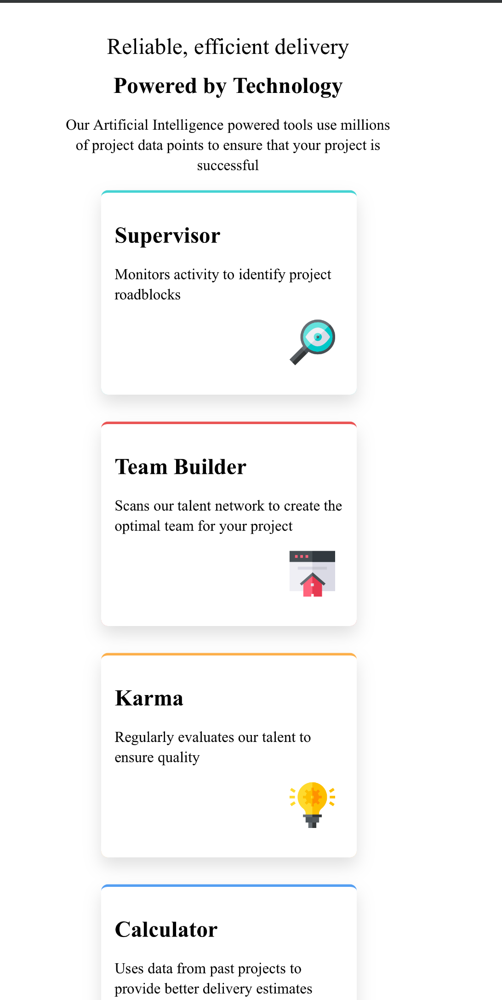
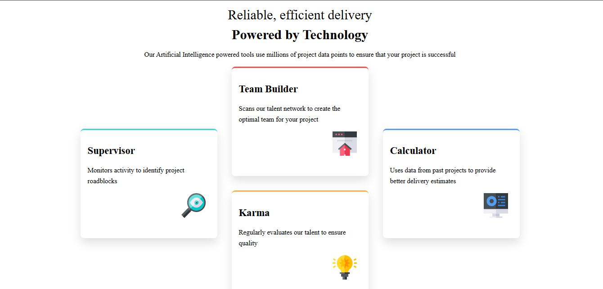

# Frontend Mentor - Four card feature section

## Welcome! 👋

Thanks for checking out this front-end coding challenge.

## The challenge

Users should be able to:

- View the optimal layout depending on their device's screen size
- Design as close to the preview as possible

### Screenshot

### Links

- Solution URL: [Solution URL here](https://github.com/Bennyufy/four-card-feature-section-challenge.git)
- Live Site URL: [Live site URL here](https://bennyufy.github.io/four-card-feature-section-challenge/)

### My Process

- This was a litle hard to navigate because of the desktop and mobile design,
I had to make further research on flexbox to be able to get the design.

It felt good and worth it to learn this,so now i know what to use in future projects.

### Built with

- Semantic HTML5 markup
- CSS custom properties
- Flexbox
- CSS Grid
- Mobile-first workflow

## Author

- Frontend Mentor - [@Bennyufy](https://www.frontendmentor.io/profile/Bennyufy)
- Github - [@Bennyufy](https://github.com/Bennyufy)
